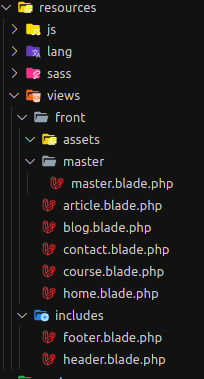

# Anotações do WebSite Desafio do Curso Laradev da UpInside Treinamentos

Template escolhido para as lições
[Template Free CSS](https://www.free-css.com/free-css-templates/page230/learn)

### Fatiando o layout

Criando a rota
> Route::get('/', 'WebController@home')->name('home');

Criar o controller
> php artisan make:controller WebController

Ao final estaremos com a seguinte estrutura


SEO com componente Externo

Componente 

[SEO Optimizer](https://packagist.org/packages/coffeecode/optimizer)

Instalação
> composer require coffeecode/optimizer

Configuração do .env
```
CLIENT_DATA_ADDRESS=""
CLIENT_DATA_COMPLEMENT=""
CLIENT_DATA_NEIGHBORHOOD=""
CLIENT_DATA_CITY=""
CLIENT_DATA_STATE=""
CLIENT_DATA_TELEPHONE=""
CLIENT_DATA_LINK_FACEBOOK=""
CLIENT_DATA_LINK_TWITTER=""
CLIENT_DATA_LINK_GITHUB=""

CLIENT_SOCIAL_TWITTER_CREATOR=""
CLIENT_SOCIAL_TWITTER_PUBLISHER=""
CLIENT_SOCIAL_FACEBOOK_APP=""
CLIENT_SOCIAL_FACEBOOK_PAGE=""
CLIENT_SOCIAL_FACEBOOK_AUTHOR=""
CLIENT_SOCIAL_GOOGLE_PAGE=""
CLIENT_SOCIAL_GOOGLE_AUTHOR=""
CLIENT_SOCIAL_INSTAGRAM_PAGE=""
CLIENT_SOCIAL_YOUTUBE_PAGE=""

```
Vamos criar um componente para abstrair o funcionamento. Caso no futuro quisermos trabalhar com outro componente então ficará mais fácil a alteração manuteção e migração do nosso código

1 - Criar um diretório na pasta **App** > **Support** e criamos a classe *seo*.

```
<?php

namespace App\Support;

use CoffeeCode\Optimizer\Optimizer;

class Seo
{
    private $optimizer;

    public function __construct()
    {
        $this->optimizer = new Optimizer();
        $this->optimizer->openGraph(
            env('APP_NAME'),
            'pt_BR',
            'article'
        )->twitterCard(
            env('CLIENT_SOCIAL_TWITTER_CREATOR'),
            env('CLIENT_SOCIAL_TWITTER_PUBLISHER'),
            env('APP_URL')
        )->publisher(
            env('CLIENT_SOCIAL_FACEBOOK_PAGE'),
            env('CLIENT_SOCIAL_FACEBOOK_AUTHOR'),
            env('CLIENT_SOCIAL_GOOGLE_PAGE'),
            env('CLIENT_SOCIAL_GOOGLE_AUTHOR')
        )->facebook(
            env('CLIENT_SOCIAL_FACEBOOK_APP')
        );
    }

    public function render(string $title, string $description, string $url, string $image, bool $follow = true)
    {
        return $this->optimizer->optimize($title, $description, $url, $image, $follow)->render();
    }
}

```

Classe SEO

Como o Método *Seo* será usado por todos os controles nós podemos instanciá-lo na classe controller e passar por herança.

Fica assim:
```
<?php

namespace App\Http\Controllers;

use App\Support\Seo;
use Illuminate\Foundation\Bus\DispatchesJobs;
use Illuminate\Routing\Controller as BaseController;
use Illuminate\Foundation\Validation\ValidatesRequests;
use Illuminate\Foundation\Auth\Access\AuthorizesRequests;

class Controller extends BaseController
{
    use AuthorizesRequests, DispatchesJobs, ValidatesRequests;

    protected $seo;

    public function __construct()
    {
        $this->seo = new Seo();
    }
}

```

Inserimos agora na master

> {!! $head ?? '' !!}
Com esse código, caso não exista não haverá erro

No controler, usamos o código:

```
public function home()
    {
        $head = $this->seo->render(
            'Inútil Education High Level',
            'Eleita a melhor escolha do universo!',
            'http://inutil.com',
            'http://inutil/image'
        );
        return view('front.home', [
            'head' => $head
        ]);
    }
```
### Parametrizando o laravel mix

Devemos para evitar conflito de versões de tema externos manter os arquivo nas respectivas versões para o layout. Iremos agrupar os arquivos seguindo a ordem passada.

Primeiro vamos remover as dependências do arquivo *package.json* que não iremos trabalhar e facaremos com o apenas:

```
"devDependencies": {
        "axios": "^0.18",
        "cross-env": "^5.1",
        "laravel-mix": "^4.0.7",
        "lodash": "^4.17.5",
        "resolve-url-loader": "^2.3.1",
        "sass": "^1.15.2",
        "sass-loader": "^7.1.0",
    }
```
Vamos rodar `npm install`

Após instalado iremos configurar o arquivo `webpack.mix.js`. Deixando todos os arquivos do template no resource

Vamos agrupar os arquivos:
```
mix
    .styles([
        'resources/views/front/assets/css/animate.css',
        'resources/views/front/assets/css/icomoon.css',
        'resources/views/front/assets/css/bootstrap.css',
        'resources/views/front/assets/css/magnific-popup.css',
        'resources/views/front/assets/css/owl.carousel.min.css',
        'resources/views/front/assets/css/owl.theme.default.min.css'
    ], 'public/front/assets/css/vendor.css')

    .scripts([
        'resources/views/front/assets/js/modernizr-2.6.2.min.js'
    ], 'public/front/assets/js/modernizr.js')

    .scripts([
        'resources/views/front/assets/js/respond.min.js'
    ], 'public/front/assets/js/respond.js')

    .scripts([
        'resources/views/front/assets/js/jquery.min.js',
        'resources/views/front/assets/js/jquery.easing.1.3.js',
        'resources/views/front/assets/js/bootstrap.min.js',
        'resources/views/front/assets/js/jquery.waypoints.min.js',
        'resources/views/front/assets/js/jquery.stellar.min.js',
        'resources/views/front/assets/js/owl.carousel.min.js',
        'resources/views/front/assets/js/jquery.countTo.js',
        'resources/views/front/assets/js/jquery.magnific-popup.min.js',
        'resources/views/front/assets/js/magnific-popup-options.js',
    ], 'public/front/assets/js/vendor.js')

    .scripts([
        'resources/views/front/assets/js/main.js'
    ], 'public/front/assets/js/main.js');

```

Para o trabalho com o SASS é necessário configurar a diretiva "options" para que ele não processe as urls do css e também efetuar a copia dos arquivos de fonts e images. O resultado do arquivo:
```
mix
    .sass('resources/views/front/assets/sass/style.scss',
            'public/front/assets/css/style.css')

    .styles([
        'resources/views/front/assets/css/animate.css',
        'resources/views/front/assets/css/icomoon.css',
        'resources/views/front/assets/css/bootstrap.css',
        'resources/views/front/assets/css/magnific-popup.css',
        'resources/views/front/assets/css/owl.carousel.min.css',
        'resources/views/front/assets/css/owl.theme.default.min.css'
    ], 'public/front/assets/css/vendor.css')

    .scripts([
        'resources/views/front/assets/js/modernizr-2.6.2.min.js'
    ], 'public/front/assets/js/modernizr.js')

    .scripts([
        'resources/views/front/assets/js/respond.min.js'
    ], 'public/front/assets/js/respond.js')

    .scripts([
        'resources/views/front/assets/js/jquery.min.js',
        'resources/views/front/assets/js/jquery.easing.1.3.js',
        'resources/views/front/assets/js/bootstrap.min.js',
        'resources/views/front/assets/js/jquery.waypoints.min.js',
        'resources/views/front/assets/js/jquery.stellar.min.js',
        'resources/views/front/assets/js/owl.carousel.min.js',
        'resources/views/front/assets/js/jquery.countTo.js',
        'resources/views/front/assets/js/jquery.magnific-popup.min.js',
        'resources/views/front/assets/js/magnific-popup-options.js',
    ], 'public/front/assets/js/vendor.js')

    .scripts([
        'resources/views/front/assets/js/main.js'
    ], 'public/front/assets/js/main.js')

    .copyDirectory('resources/views/front/assets/fonts', 'public/front/assets/fonts')
    .copyDirectory('resources/views/front/assets/images', 'public/front/assets/images')

    // para fazer com que o processador não copie para o diretório
    .options({
        processCssUrls: false
    })

    .version();

```

Lembrando que para usar o *version* temos que usar o helper *mix*

Qualquer alteração devemos rodar
>npm run dev

Sempre alterar o arquivo no resource.

Antes de enviar nossa aplicação para produção devemos rodar
> npm run production

Assim nossos arquivos serão mimificados

---

Ao inserir arquivos externos que modifiquem nossas views devemos apagar o cache das páginas que ficam em: *storage>framework>view*

---
### Aprendendo a criar um helper

Na pasta *app* iremos criar um novo diretório *Helpers* (lembrar de seguir o padrão das pastas). Criamos um arquivo *Helpers.php*.

```
<?php

if (!function_exists('mix_e')) {
    /**
     * Get the path to a versioned Mix with Url file.
     *
     * @param  string  $path
     * @return \Illuminate\Support\HtmlString|string
     *
     * @throws \Exception
     */
    function mix_e($path)
    {
        return url(mix($path));
    }
}
```
Vamos alterar no template a chamada

> <link rel="stylesheet" href="{{ mix_e('front/assets/css/vendor.css') }}">

Para funcionar é preciso fazer com que o *composer* veja esse arquivo. Fica assim:
```
    "autoload": {
        "psr-4": {
            "App\\": "app/"
        },
        "classmap": [
            "database/seeds",
            "database/factories"
        ],
        "files": [
            "app/Helpers/Helpers.php"
        ]
    },

```
Pedimos ao composer para fazer uma releitura dos arquivos
> composer dump-autoload 

### Parte dinâmicass

Passos:

- Criar um banco de dados.
- Parametrizar o .env

Criando o model

> php artisan make:model Post -m

Criando a migration

```
Schema::create('posts', function (Blueprint $table) {
            $table->increments('id');
            $table->string('uri');
            $table->string('title');
            $table->string('subtitle');
            $table->string('cover')->nullable();
            $table->text('content');
            $table->integer('views')->default(0);
            $table->unsignedInteger('author');
            $table->timestamps();

            $table->foreign('author')
                ->references('id')
                ->on('users')
                ->onDelete('cascade');
        });
```

Rodando a migration
> php artisan migrate

Criando as factories
> php artisan make:factory PostFactory

```
$factory->define(Model::class, function (Faker $faker) {

    $title = $faker->paragraph(1);

    return [
        'uri' => str_slug($title),
        'title' => str_slug($title),
        'subtitle' => $faker->paragraph(1),
        'content' => $faker->paragraph(10),
        'author' => 1
    ];
});
```

Criando a seeder
> php artisan make:seeder PostTableSeeder

```
 factory(Post::class, 12)->create();
```
> php artisan make:seeder UserTableSeeder

```
    factory(User::class, 1)->create();
```

Alimentamos o `DatabaseSeeder.php`

```
public function run()
    {
        // $this->call(UsersTableSeeder::class);
        $this->call([
             UserTableSeeder::class,
             PostsTableSeeder::class
        ]);
    }
```
Rodando as seeders
> php artisan db:seed

Caso dê um erro roda tudo de novo
> php artisan migrate:fresh --seed

Vamos resolver o problema das imagens, já que não vamos ter painel de administração. Criamos o link simbólico do **resource** para o **public**

> php artisan storage:link

Feito os devidos ajustes vamos trabalhar com um componente para ajustar nossas imagens

para podemos usar a ` Illuminate\Support\Facades\` devemos alterar o config do filesystem para fazer referência a pasta public. Vamos defini-la no .env

> FILESYSTEM_DRIVER=public

E alteramos a url do nosso projeto também no .env
> APP_URL=http://localhost/curso_laradev/project_course/public/

o home.blade.php, na dobra article vai ficar assim:
```
@foreach ($posts as $post)
<div class="col-lg-4 col-md-4">
    <div class="fh5co-blog animate-box">
        <a href="{{ route('article', $post->uri) }}">cover) }}" alt=""></a>
        <div class="blog-text">
            <h3><a href="{{ route('article', $post->uri) }}">{{ $post->title }}</a></h3>
            <span class="posted_on">{{ date('d/m/Y H:i', strtotime($post->created_at)) }}</span>
            <span class="comment"><a href="">21<i class="icon-speech-bubble"></i></a></span>
            <p>{{ $post->subtitle }}</p>
            <a href="{{ route('article', $post->uri) }}" class="btn btn-primary">Leia mais</a>
        </div>
    </div>
</div>
@endforeach

```
Para padronizar a exibição das imagens vamos utilizar o componente

> https://packagist.org/packages/coffeecode/cropper

Vamos instalar
> composer require coffeecode/cropper

Vamos criar uma classe
```
<?php

namespace App\Support;

use CoffeeCode\Cropper\Cropper as CropperCropper;

class Cropper
{
    public static function thumb(string $uri, int $width, int $height = null)
    {
        $cropper = new CropperCropper('../public/storage/cache');
        $pathThumb = $cropper->make(config('filesystems.disks.local.root'). '/' . $uri, $width, $height);

        $file = 'cache/'.collect(explode('/', $pathThumb))->last();
        return $file;
    }
}

```

Lembrando que o static é para não precisamos instanciar nossa classe.

Vamos alterar agora na tag img.

```php
@foreach ($posts as $post)
<div class="col-lg-4 col-md-4">
    <div class="fh5co-blog animate-box">
        <a href="{{ route('article', $post->uri) }}">cover, 800, 450)) }}" alt=""></a>
        <div class="blog-text">
            <h3><a href="{{ route('article', $post->uri) }}">{{ $post->title }}</a></h3>
            <span class="posted_on">{{ date('d/m/Y H:i', strtotime($post->created_at)) }}</span>
            <span class="comment"><a href="">21<i class="icon-speech-bubble"></i></a></span>
            <p>{{ $post->subtitle }}</p>
            <a href="{{ route('article', $post->uri) }}" class="btn btn-primary">Leia mais</a>
        </div>
    </div>
</div>
@endforeach
```
### Comentários do facebook

Acessando a url [Comments Plugin](https://developers.facebook.com/docs/plugins/comments/?locale=pt_BR)

Pegamos apenas o `appId` e inserimos no nosso.

Ps: Tive problemas para gerar no firefox.

```php

<div class="col-12">
    <div class="fb-comments" data-href="{{ Request::url() }}" data-numposts="5" data-width="100%"></div>
</div>


@section('scripts')
    <div id="fb-root"></div>
    <script async defer
            src="https://connect.facebook.net/pt_BR/sdk.js#xfbml=1&version=v3.2&appId=APPID&autoLogAppEvents=1"></script>
@endsection
```
Lembrando que devemos ter como a url da publicação

---
Enviar o formulário de Email

Lembrando de fazer as parametrizações no arquivo `.env`

```php
MAIL_DRIVER=
MAIL_HOST=
MAIL_PORT=
MAIL_USERNAME=
MAIL_PASSWORD=
MAIL_ENCRYPTION=
MAIL_FROM_ADDRESS=noreply@jaqueline.dev
MAIL_FROM_NAME=
```

Vamos criar o email com o markdown para temos um layout mais bonito.

> php artisan make:mail Contact --markdown=email.contact

Método `app>mail>Contact.php`
```
<?php

namespace App\Mail;

use Illuminate\Bus\Queueable;
use Illuminate\Mail\Mailable;
use Illuminate\Queue\SerializesModels;
use Illuminate\Contracts\Queue\ShouldQueue;

class Contact extends Mailable
{
    use Queueable, SerializesModels;

    private $data;

    /**
     * Create a new message instance.
     *
     * @return void
     */
    public function __construct(array $data)
    {
        $this->data = $data;
    }

    /**
     * Build the message.
     *
     * @return $this
     */
    public function build()
    {
        return $this->replyTo($this->data['reply_email'], $this->data['reply_email'])
            ->to(env('MAIL_FROM_ADDRESS'), env('MAIL_FROM_NAME'))
            ->from(env('MAIL_FROM_ADDRESS'), env('MAIL_FROM_NAME'))
            ->subject('[NOVO CONTATO]: ' . $this->data['subject'])
            ->markdown('email.contact', [
                'reply_name' => $this->data['reply_name'],
                'reply_email' => $this->data['reply_email'],
                'subject' => $this->data['subject'],
                'message' => $this->data['message']
            ]);
    }
}
```

View `email>contato.blade.php`, responsável pela email que será enviado.
```
@component('mail::message')
Olá Você recebeu um novo contato a partir de seu site!

Nome: <strong>{{ $reply_name }}</strong>

Email: <strong> {{ $reply_email }} </strong>

Sobre: <strong>{{ $subject }}</strong>

Mensagem:

@component('mail::panel')
{{ $message }}
@endcomponent

@endcomponent
```

Para podemos testar as visualização do nosso método
```
public function sendMail(Request $request)
    {
        $data = [
            'reply_name' => $request->first_name . ' - ' . $request->last_name,
            'reply_email' => $request->email,
            'subject' => $request->subject,
            'message' => $request->message
        ];

        return new Contact($data);
    }
```

Para enviar devemos altear o método `sendMail`

```
public function sendMail(Request $request)
    {
        $data = [
            'reply_name' => $request->first_name . ' - ' . $request->last_name,
            'reply_email' => $request->email,
            'subject' => $request->subject,
            'message' => $request->message
        ];

        // return new Contact($data);
        Mail::send(new Contact($data));

        return redirect()->route('contact');
    }
```
